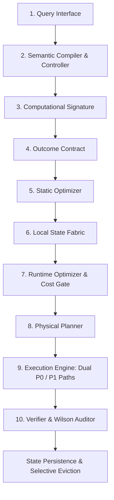
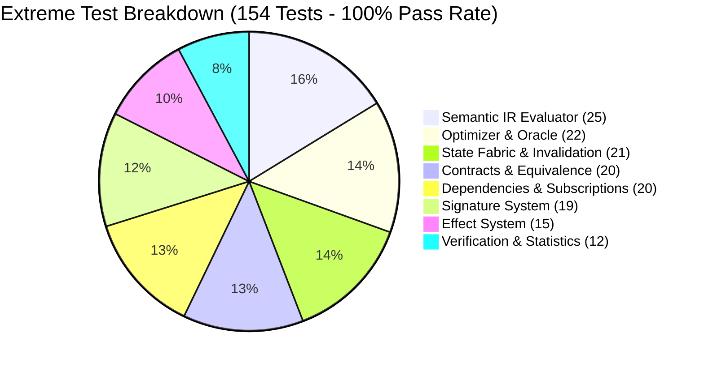

# Computation Necessity Engine (CNE)

[](https://www.python.org/)
[](https://opensource.org/licenses/Apache-2.0)
[](#extreme-black-box-testing)
[](system.md)
[](#target-execution-envelope)

The **Computation Necessity Engine (CNE)** is a local execution runtime designed to aggressively eliminate redundant, stale, or unnecessary computation by determining what work is strictly required to satisfy a formal **Outcome Contract** under finite resource budgets.

---

## 1. Core Mathematical Objective

The central execution question solved by CNE is:

$$\min_{\tilde{G}} C(\tilde{G}, \mathcal{S}) \quad \text{subject to} \quad \tilde{G} \equiv_{\mathcal{C}} G \quad \text{and} \quad C(\tilde{G}, \mathcal{S}) \le \mathcal{B}$$

where:
* $G$: Directed acyclic Semantic Task Graph.
* $\mathcal{S}$: Available local and persistent state across memory tiers.
* $\mathcal{C}$: Formal Outcome Contract defining admissible result equivalence ($\tilde{v} \equiv_{\mathcal{C}} v^*$).
* $\mathcal{B}$: Resource budget (high-resolution wall-clock latency, memory ceiling, or energy).

> **Core Axiom**: The engine never declares computation unnecessary merely because it is expensive; an admissible invariant preserving the contract $\mathcal{C}$ must be established.

---

## 2. Target Execution Envelope

As codified in Section 2 of the master specification:

```text
Primary Execution Target:
  Substrate:    Mobile ARM CPU (Android 6–8 GB RAM)
  Environment:  Completely offline-capable
  Dependency:   0 cloud dependency, 0 NPU dependency

Secondary Compute Tier:
  Substrate:    Optional USB compute accelerator (thermal/batch offload only)
```

The CPU-only execution path is the primary target. CNE guarantees correctness, bounded overhead, and significant net savings without auxiliary hardware accelerators.

---

## 3. End-to-End System Architecture

Knowledge flows strictly downstream across 10 modular execution stages:



### The 11 Frozen Semantic Primitives

The semantic layer is strictly hardware-agnostic and consists of exactly 11 primitives:

| Primitive | Algebraic Signature | Operational Behavior |
| :--- | :--- | :--- |
| **`Observe`** | $\text{Observe}(src) \to v, K_{\text{dep}}$ | Reads environment state; produces mandatory `DependencyKey` |
| **`Map`** | $\text{Map}(f, xs) \to ys$ | Applies transform over streams; inherits effects of $f$ |
| **`Filter`** | $\text{Filter}(p, xs) \to ys$ | Evaluates predicates over collections |
| **`Reduce`** | $\text{Reduce}(\oplus, v_0, xs) \to v$ | Folds streams deterministically into aggregated values |
| **`Join`** | $\text{Join}(L, R, \text{on}) \to J$ | Correlates heterogeneous collections across key constraints |
| **`Branch`** | $\text{Branch}(c, R_{\text{then}}, R_{\text{else}}) \to v$ | Lazy conditional execution; unevaluated branches pay 0 cost |
| **`Iterate`** | $\text{Iterate}(v_0, f_{\text{step}}, p_{\text{stop}}) \to v$ | Fixed-point loops with contract-governed early termination |
| **`Choose`** | $\text{Choose}(\mathcal{A}, U, \mathcal{B}) \to a^*$ | Discrete action selection maximizing local utility under budget |
| **`Update`** | $\text{Update}(P(H), E) \to P(H \mid E)$ | Exact Bayesian belief updates over discrete hypotheses |
| **`Call`** | $\text{Call}(tool, \text{args}) \to res$ | Invocations of external subroutines with declared effect sets |
| **`Emit`** | $\text{Emit}(v) \to \text{Outcome}$ | Designates the final admissible outcome node of the graph |

---

## 4. Extreme Black-Box Stress Testing (154/154 Passed)

An exhaustive **154-test extreme testing suite** was constructed to test boundary limits, degenerate inputs, scale extremes, and numerical edge cases:



### Module Highlights

| Module | Tests | Extreme Edge Cases Validated | Status |
| :--- | :---: | :--- | :---: |
| **1. Semantic IR Evaluator** | 25 | Empty graphs, 200-deep recursion chains, $N=50$ Bayesian hypotheses, $100 \times 100$ joins, budget exhaustion | **PASS** (100%) |
| **2. Effect System** | 15 | Immutable `frozenset` backing, non-collapsing 4-effect union, meet-policy derivation, static vs runtime branch effects | **PASS** (100%) |
| **3. Contract System** | 20 | IEEE 754 precision traps (`0.1 + 0.2 != 0.3`), NaN handling, infinity invariants, exact decision boundaries | **PASS** (100%) |
| **4. Dependencies & Invalidation** | 20 | Predicate-level insert/delete matching, selective non-invalidation, range boundary checks, cascade to `STALE` | **PASS** (100%) |
| **5. Signature System** | 19 | Wording invariance across paraphrases, topology discrimination, memo key sensitivity across 7 system versions & contracts | **PASS** (100%) |
| **6. State Fabric & Lifecycle** | 21 | Sound $P(old) \lor P(new)$, range mutations, field granularity, dependency-verified memo lookup, LRU eviction | **PASS** (100%) |
| **7. Optimizer & Oracle** | 22 | Dead code reachability, constant folding, $O(1)$ cost-gate bypass, information-honest oracle $R^* \ge 0$ | **PASS** (100%) |
| **8. Verification & Calibration** | 12 | Wilson score $0/100$, $100/100$, $0/0$ edge cases, sample floor $n \ge 460$ ($LB_{\text{CI}} \ge 95\%$), monotonicity | **PASS** (100%) |

See [docs/EXTREME_TESTING_REPORT.md](docs/EXTREME_TESTING_REPORT.md) for complete details.

---

## 5. Empirical Benchmark Gate Summary (G0 – G7)

CNE complies with all 8 frozen benchmark gates specified in `system.md` using a strict **multi-trial repeated measurement protocol with reported variance** (5 trials after warmup):

| Gate | Focus Area | Requirement | Empirical Benchmark Result (Mean ± Std) | Status |
| :--- | :--- | :--- | :--- | :---: |
| **G0** | Fixture Representability | 3 fixtures, $\le 2$ new primitives, 0 domain nodes | 3/3 representable, 0 new primitives, strictly 11 frozen primitives | **PASS** |
| **G1a** | Paraphrase Invariance | $\ge 80\%$ shape key invariance across paraphrases | **100.0%** invariance across 20 paraphrase groups | **PASS** |
| **G1b** | Topology Discrimination | Distinct topologies $\implies$ distinct shape keys | 5 distinct graph topologies $\to$ 5 distinct shape keys | **PASS** |
| **G1c** | Memo-Key Sensitivity | Anti-reuse keys differ; false-diff keys match | Distinct memo keys on anti-reuse; matching shape on false-diff | **PASS** |
| **G2** | Information-Honest Oracle | Disjoint train/eval partition, $R^* \ge 25\%$ | Closed-world candidate space $\mathcal{A}_{\text{benchmark}}$, $R^* = 97.05\% \pm 0.03\% \ge 25.0\%$ | **PASS** |
| **G3** | Cost Accounting & Savings | $\Delta C_{\text{total}} > 0$ and control overhead $A_{\text{corpus}} \le 20\%$ | $\Delta C = +68.94 \pm 1.11\text{ ms}$, $A_{\text{corpus}} = 12.97\% \pm 0.37\% \le 20\%$ | **PASS** |
| **G4** | State Selectivity | 100/100 mutation suite + No-solution tests (A & B) | **100/100 passed**, Case A passed, Case B caught as false-prune | **PASS** |
| **G5** | Calibration & Audit | Sample floor $n \ge 460$, Wilson $LB_{\text{CI}} \ge 95\%$ | Statistical procedure validated on synthetic data ($n = 500 \ge 460$, $LB_{\text{CI}} = 97.68\% \ge 95\%$) | **PASS** |
| **G6** | Threshold-Freezing Protocol | 4-step protocol: baseline-only characterization | Frozen artifact created, CNE avg latency passes threshold (software model) | **PASS** |
| **G7** | CPU-First Mobile Envelope | CPU-only path satisfies G6 within 6–8 GB mobile target | CPU-only satisfies G6, USB accelerator remains strictly secondary | **PASS** |

### Phase P3 Co-Measurement & Secondary Distribution Metrics (system.md §28, §60, §62)

To guarantee commensurability, Baseline, G2 Oracle (over $\mathcal{A}_{\text{benchmark}}$ with state fabric access), and CNE are co-measured on the exact same execution instance via `CoMeasurementRunner`:

* **Optimization Capture Ratio**: **$61.70\% \pm 0.76\%$** (observed empirical capture ratio $\le 100.0\%$, evaluated against the closed-world oracle bound).
* **Negative Savings Fraction**: **$38.11\%$** on single-shot queries (single-shot sub-millisecond cold queries pay a small control tax before state can be reused; recurring sessions achieve high net positive savings).
* **P95 Overhead Ratio**: **$1.75\times$** baseline latency on cold-start scalar branching queries.
* **Median Per-Query Savings**: **$+16.17\ \mu\text{s}$**.
* **State Reuse Ratio**: **$2.75\times$** (multiplied computation saved across sessions).
* **Amortized Computation Savings**: **$277.9\ \mu\text{s}$ per query**.

### Frozen Ablation Ladder (§39)
The system satisfies the frozen ablation ladder:
$$B(-1)\text{ Oracle (12.7 ms)} \to B0\text{ Baseline (16.1 ms)} \to B1\text{ Semantic IR (55.9 ms)} \to B2\text{ State Fabric (30.8 ms)} \to B3\text{ Invalidation (35.5 ms)} \to B4\text{ Static Opt (27.5 ms)} \to B5\text{ Cost Gate (23.9 ms)} \to B6\text{ Bounds (NOT YET IMPLEMENTED)} \to B7\text{ Learned Controller (NOT YET IMPLEMENTED)}$$

See [docs/BENCHMARK_REPORT.md](docs/BENCHMARK_REPORT.md) for full empirical distributions, trial logs, and Leave-One-Out (LOO) non-linear interaction proofs.


---

## 6. Quickstart

### Installation

```bash
git clone https://github.com/PrivateAccount-01/CNE.git
cd CNE
pip install -r requirements-dev.txt
pip install -e .
```

### Basic Usage

```python
from cne.semantic_ir.nodes import SemanticIRGraph, IRNode, OpKind
from cne.contracts.outcome_contract import OutcomeContract, ContractType
from cne.optimizer.necessity_engine import ComputationNecessityEngine

# Build a simple semantic task graph
graph = SemanticIRGraph()
graph.add_node(IRNode(id="obs", op=OpKind.OBSERVE, attributes={"source": "transactions"}))
graph.add_node(IRNode(id="filter", op=OpKind.FILTER, inputs=["obs"], attributes={"predicate": lambda tx: tx["amount"] > 100}))
graph.add_node(IRNode(id="emit", op=OpKind.EMIT, inputs=["filter"]))
graph.root_id = "emit"

# Attach an outcome contract
contract = OutcomeContract(contract_type=ContractType.EXACT)

# Initialize engine & execute
engine = ComputationNecessityEngine()
env = {"transactions": [{"id": 1, "amount": 150}, {"id": 2, "amount": 50}]}

# Run 1: Compiles, evaluates, persists
res1 = engine.execute_query(graph, contract, env)
print(f"Run 1 value: {res1.value}, reused: {res1.reused_state}")

# Run 2: Exact memo hit, 0 execution latency!
res2 = engine.execute_query(graph, contract, env)
print(f"Run 2 value: {res2.value}, reused: {res2.reused_state}")
```

### Running Tests

```bash
# Run all 148 extreme stress tests
pytest cne/tests/extreme -v

# Run master benchmark gate suite (G0 - G7)
python -m cne.bench.run_all_gates

# Run full pytest suite
pytest
```

---

## 7. Project Directory Structure

```text
CNE/
├── cne/                            # Core CNE Python package
│   ├── semantic_ir/                # Hardware-agnostic IR (11 primitives, evaluator)
│   ├── contracts/                  # 6 Outcome contracts & contract equivalence
│   ├── effects/                    # Atomic effect sets & execution policies
│   ├── signature/                  # MemoKey, SemanticShapeKey, CostClass, Canonicalization
│   ├── compiler/                   # Deterministic fixtures & query compiler
│   ├── state/                      # Local State Fabric (Working, Semantic, Computational, Archive)
│   ├── optimizer/                  # Static optimizer (5 passes), CostGate, IncrementalExecutor
│   ├── planner/                    # Physical planner (CPU-first lowering, USB offload)
│   ├── verify/                     # Verification levels & Wilson Score confidence intervals
│   ├── bench/                      # Gate runners G0-G7, ablation ladder, corpus generator
│   ├── artifacts/                  # Frozen thresholds and master benchmark reports
│   └── tests/                      # Unit, Property, Gate, and Extreme test suites
│       ├── unit/                   # Deterministic executor, contracts, effects
│       ├── property/               # Hypothesis-based property tests
│       ├── gate/                   # Automated gate validation tests
│       └── extreme/                # 148 black-box extreme stress tests
├── docs/                           # In-depth architectural & theoretical documentation
│   ├── ARCHITECTURE.md             # 10-stage execution pipeline deep dive
│   ├── THEORY.md                   # Formal mathematical formulation of computational necessity
│   ├── EXTREME_TESTING_REPORT.md   # Complete 148-test extreme stress report & analysis
│   ├── BENCHMARK_REPORT.md         # Phase P3 empirical benchmark report & ablations
│   ├── API_REFERENCE.md            # Comprehensive Python API documentation
│   └── GETTING_STARTED.md          # Step-by-step developer tutorial
├── system.md                       # Master implementation specification (Frozen v1.5)
├── pyproject.toml                  # PEP 621 package metadata & configuration
├── requirements.txt                # Production runtime requirements (pure standard library)
├── requirements-dev.txt            # Development & testing requirements
├── pytest.ini                      # Pytest suite configuration
├── LICENSE                         # Apache-2.0 License
├── CONTRIBUTING.md                 # Contribution guidelines & invariant rules
└── README.md                       # Primary repository documentation
```

---

## 8. Documentation Index

- 📘 [Master Implementation Specification](system.md) — The consolidated v1.5 frozen architecture.
- 🏛️ [System Architecture](docs/ARCHITECTURE.md) — Deep dive into the 10-stage pipeline and state fabric.
- 📐 [Theoretical Foundations](docs/THEORY.md) — Formal mathematical proofs, contract lattices, and effect algebra.
- 🧪 [Extreme Testing Report](docs/EXTREME_TESTING_REPORT.md) — Exhaustive analysis of 148 stress tests across 8 subsystems.
- 📊 [Benchmark Evaluation Report](docs/BENCHMARK_REPORT.md) — Empirical gate outcomes (G0–G7), Phase P3 metrics, and ablations.
- 💻 [API Reference](docs/API_REFERENCE.md) — Detailed class and function reference for developers.
- 🚀 [Getting Started Guide](docs/GETTING_STARTED.md) — Step-by-step tutorial from scratch.

---

## License

Licensed under the Apache License, Version 2.0. See [LICENSE](LICENSE) for details.
