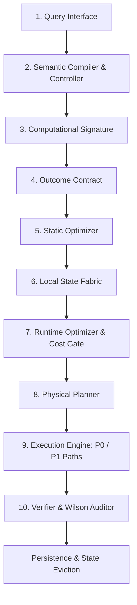
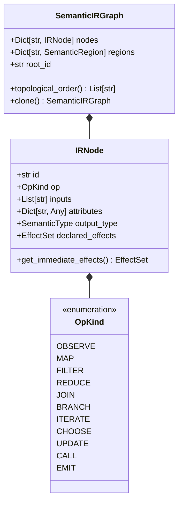
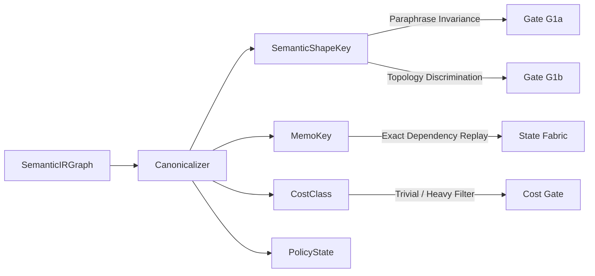
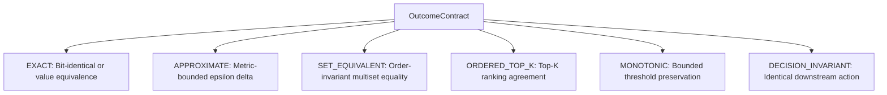
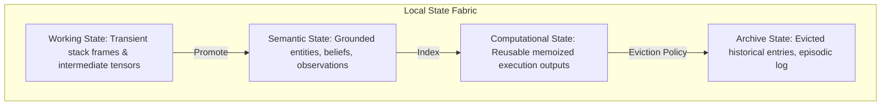
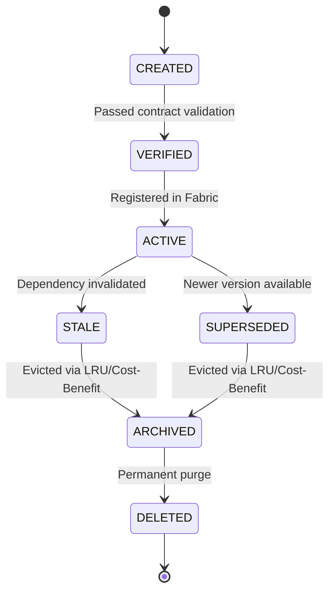

# CNE System Architecture

The **Computation Necessity Engine (CNE)** is a local execution runtime designed to eliminate redundant computation by mathematically determining what work is strictly necessary to satisfy a user-specified Outcome Contract under finite resource budgets.

---

## 1. End-to-End Execution Pipeline

CNE enforces a strictly layered 10-stage execution pipeline. Knowledge flows strictly downstream from high-level semantics to physical hardware execution, preventing abstraction leaks.

### Component Responsibility Boundary Matrix

| Component | Primary Responsibility | Strict Isolation (Must NOT Know) |
| :--- | :--- | :--- |
| **Query Interface** | Natural language request handling, conversational context, user intent | Physical hardware layout, cache structures |
| **Semantic Compiler** | Compiles query into typed `SemanticIRGraph` and `OutcomeContract` | Model placement, memory addresses |
| **Computational Signature** | Computes `MemoKey`, `SemanticShapeKey`, `CostClass`, and `PolicyState` | Surface wording, variable naming |
| **Outcome Contract** | Specifies admissible outcome equivalence ($\mathcal{A} \equiv_C \mathcal{B}$) | Physical implementation techniques |
| **Static Optimizer** | Graph reachability, constant folding, static slicing, contract pruning | Dynamic runtime values, cache entries |
| **Local State Fabric** | Multi-tier state store: Working, Semantic, Computational, Archive | Neural network weights, specific model families |
| **Runtime Optimizer** | Fast $O(1)$ cost-gate check, memo lookup, incremental dirty-cone replay | Specific execution hardware architectures |
| **Physical Planner** | Lowers semantic operations to CPU kernels, retrieval engines, or USB tiers | User query surface wording |
| **Execution Engine** | Executes surviving irreducible computation via dual P0/P1 paths | Domain-specific application heuristics |
| **Verifier / Auditor** | Quantifies empirical evidence status, computes Wilson Score confidence bounds | Internal optimizer cost functions |

---

## 2. Hardware-Agnostic Semantic IR

The Semantic IR decouples computational logic from physical hardware placement. It comprises exactly **11 frozen primitives**:

### The 11 Semantic Primitives

1. **`Observe(source)`**: Reads external or environment state. Always produces an explicit `DependencyKey` for sound invalidation.
2. **`Map(f, xs)`**: Applies a transformation over collections. Inherits effects from `f`.
3. **`Filter(p, xs)`**: Evaluates predicates over streams/collections.
4. **`Reduce(op, init, xs)`**: Folds collections deterministically into scalar or aggregated representations.
5. **`Join(left, right, on)`**: Correlates heterogeneous collections across key constraints.
6. **`Branch(cond, then_region, else_region)`**: Lazy conditional evaluation; unselected branches remain unevaluated.
7. **`Iterate(init, step_fn, stop_pred)`**: Iterative fixed-point or bounded loops with contract-governed termination.
8. **`Choose(actions, utility_fn, budget)`**: Discrete action selection optimizing local utility under resource budgets.
9. **`Update(prior, evidence)`**: Exact Bayesian belief state updates over discrete hypothesis distributions.
10. **`Call(tool, args)`**: Interacts with external tools/subroutines; declared effects must be explicit.
11. **`Emit(value)`**: Designates the final admissible outcome node of the graph.

---

## 3. Computational Signatures

Signatures project complex semantic graphs into compact, invariant representations for memoization, clustering, and cost estimation.

### Signature Components

1. **`MemoKey`**: A cryptographic SHA-256 identity combining the canonical topological graph descriptor, input data, system version vector (model, tokenizer, runtime, schema versions), and dependency snapshots.
2. **`SemanticShapeKey`**: An abstraction representing control-flow topology, operator sequences, and type signatures. Invariant to variable labels, comments, and natural language paraphrasing.
3. **`CostClass`**: Categorizes operations into `TRIVIAL`, `LIGHTWEIGHT`, `MODERATE`, or `HEAVY` based on operator counts, external invocations, and collection cardinality brackets.
4. **`PolicyState`**: Summarizes hypothesis beliefs, remaining execution budgets, and candidate action sets for `Choose` operations.

---

## 4. Outcome Contracts and Equivalence

An **Outcome Contract** ($\mathcal{C}$) formalizes the acceptable error envelope and constraints for a computation:

$$\text{Admissibility: } \tilde{v} \equiv_{\mathcal{C}} v^*$$

### Supported Contract Types

- **`EXACT`**: Strict bit-level or algebraic equality.
- **`APPROXIMATE`**: $\vert v_1 - v_2 \vert \le \epsilon_{\text{abs}} + \epsilon_{\text{rel}} \cdot \vert v_2 \vert$.
- **`SET_EQUIVALENT`**: Multiset equality regardless of stream arrival order.
- **`ORDERED_TOP_K`**: Exact or metric match over top-$K$ items.
- **`MONOTONIC`**: Decision rule invariance across monotonic threshold transformations.
- **`DECISION_INVARIANT`**: Two intermediate states $s_1, s_2$ are equivalent if they induce identical policy choices $\pi(s_1) = \pi(s_2)$.

---

## 5. Local State Fabric

The **Local State Fabric** manages all state lifetimes across 4 memory tiers:

### State Lifecycle State Machine

### Retention Policies

- **LRU (Least Recently Used)**: Default low-overhead eviction.
- **Cost-Benefit ($CB = \frac{C_{\text{saved}} \times \text{Hits}}{\text{Size}}$)**: Prioritizes entries that save high recomputation latency.
- **TTL (Time-To-Live)**: Purges stale real-time telemetry.

---

## 6. Static and Runtime Optimization

CNE divides optimization into zero-cost compile-time static analysis and an ultra-fast runtime cost gate:

### Static Optimization (5 Passes)
1. **Reachability Analysis**: Backward DFS from `Emit` and effect-bearing nodes, pruning dead subgraphs.
2. **Constant Folding**: Pure deterministic compile-time evaluation of constant literals.
3. **Static Effect Propagation ($E_{\text{static}}$)**: Conservative union across all branches ensuring no side-effect suppression.
4. **Static Dependency Slicing**: Identifies minimal upstream input subgraphs necessary for contract satisfaction.
5. **Contract Simplification**: Replaces expensive multi-stage joins or sorts with projected filter cuts when downstream contracts allow.

### Runtime Cost Gating
Before spending control cycles running the static optimizer, CNE checks:
$$\text{CostGate}(\text{CostClass}) \implies \begin{cases} \text{Bypass Optimizer} & \text{if Tier} \in \{\text{TRIVIAL}, \text{LIGHTWEIGHT}\} \\ \text{Engage Optimizer} & \text{otherwise} \end{cases}$$

---

## 7. Dual Execution Paths: P0 vs P1

- **P0 Path (Deterministic Baseline)**: Pure standard Python/ARM evaluation without neural model calls. Serves as ground-truth verifier and emergency fallback.
- **P1 Path (Optimized Necessity Pipeline)**: Employs memoization, incremental dirty-cone recomputation, and hardware-accelerated lowering.

---

## 8. Physical Planner & Mobile Execution Envelope

- **Primary Target**: Android 6–8 GB RAM, ARM CPU, 0 cloud dependency, 0 NPU dependency.
- **Secondary Tier**: Optional USB compute accelerator (auto-offloaded under thermal throttling or high batch queues).
