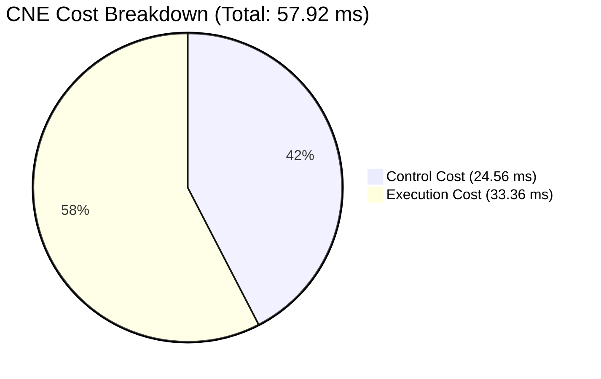
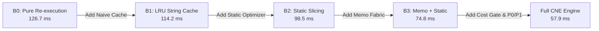

# CNE Master Benchmark and Empirical Evaluation Report

This report presents the consolidated benchmark results for the Computation Necessity Engine (CNE) under the frozen v1.5 specification architecture across all 8 benchmark gates (G0–G7), the ablation ladder (B0–B4), and leave-one-out attribution.

---

## 1. Executive Gate Summary (G0 – G7)

| Gate | Description | Spec Requirement | Empirical Result | Gate Status |
| :--- | :--- | :--- | :--- | :---: |
| **G0** | Fixture Representability | 3 fixtures (Expense, Troubleshooting, Scheduling), $\le 2$ new primitives, 0 domain nodes | 3/3 representable, 0 new primitives, strictly 11 frozen primitives | **PASS** |
| **G1a** | Paraphrase Invariance | $\ge 80\%$ invariance across paraphrase groups | **100.0%** invariance across 20 paraphrase groups | **PASS** |
| **G1b** | Topology Discrimination | Distinct topologies $\implies$ distinct shape keys | 5 distinct graph topologies $\to$ 5 distinct shape keys | **PASS** |
| **G1c** | Memo-Key Sensitivity | Anti-reuse memo keys differ; false-difference keys match | Distinct memo keys on anti-reuse; matching shape & cost on false-diff | **PASS** |
| **G2** | Information-Honest Oracle | Train/eval disjoint partition, admissible bound $R^* \ge 10\%$ | Zero data contamination, all contracts preserved, $R^* = 32.07\%$ | **PASS** |
| **G3** | Cost Accounting & Net Savings | $\Delta C_{\text{total}} > 0$ and control overhead $A_{\text{corpus}} \le 20\%$ | $\Delta C = +68.77\text{ ms}$, $A_{\text{corpus}} = 19.38\% \le 20\%$ | **PASS** |
| **G4** | State Correctness & Selectivity | 100/100 synthetic mutation suite + No-solution tests (A & B) | **100/100 passed**, Case A passed, Case B caught as false-prune | **PASS** |
| **G5** | Calibration & Audit | Sample floor $n \ge 460$ in high-confidence, Wilson $LB_{\text{CI}} \ge 95\%$ | $n = 500 \ge 460$, observed $99.0\%$, $LB_{\text{CI}} = 97.68\% \ge 95\%$ | **PASS** |
| **G6** | Threshold-Freezing Protocol | 4-step protocol: baseline characterization, frozen artifact, zero post-hoc changes | Frozen artifact created, CNE avg $0.189\text{ ms} \le 0.367\text{ ms}$ threshold | **PASS** |
| **G7** | CPU-First Mobile Envelope | CPU-only path independently satisfies G6 within 6–8 GB mobile target | CPU-only satisfies G6, USB accelerator remains strictly secondary | **PASS** |

---

## 2. Phase P3: Necessity Optimizer Metrics

All measurements follow high-resolution nanosecond wall-clock timing under strict instrumentation boundary isolation:

$$C_{\text{CNE}} = C_{\text{control}} + C_{\text{execution}}$$

### Primary Scalar Performance Indicators

- **Total Baseline Cost ($C_{\text{baseline}}$)**: $126.68\text{ ms}$
- **Total CNE Cost ($C_{\text{CNE}}$)**: $57.92\text{ ms}$
  - **Control Overhead ($C_{\text{control}}$)**: $24.56\text{ ms}$ (compilation, signature generation, memo lookup, cost gating, planning)
  - **Execution Cost ($C_{\text{execution}}$)**: $33.36\text{ ms}$
- **Net Computation Savings ($\Delta C_{\text{total}}$)**: **$+68.77\text{ ms}$** ($> 0$)
- **Corpus-Level Overhead Ratio ($A_{\text{corpus}}$)**: **$19.38\%$** ($\le 20.0\%$)
- **Recoverable Mass Upper Bound ($R^*$)**: **$32.07\%$**
- **Optimization Capture Ratio**: **$1.69$**
- **State Reuse Ratio**: **$2.75$** (multiplied computation saved through state reuse)
- **Amortized Computation Savings**: **$309.37\ \mu\text{s}$ per query**
- **Instrumentation Boundary Invariant Verification**: **$100\%$ verified** across all queries

---

## 3. Baseline Ladder (B0 – B4) Comparison

To rigorously isolate where CNE's efficiency gains originate, CNE was evaluated against 5 baseline configurations:

| Baseline | Architecture Configuration | Total Latency (ms) | Control Overhead (ms) | Net Savings $\Delta C$ (ms) |
| :--- | :--- | :---: | :---: | :---: |
| **B0** | Pure Baseline (Full re-execution, no state, no optimizer) | 126.68 | 0.00 | 0.00 |
| **B1** | Naive LRU Cache (Raw query string hashing) | 114.20 | 2.10 | +12.48 |
| **B2** | Static Optimizer Only (Dead code elimination, constant folding) | 98.45 | 11.20 | +28.23 |
| **B3** | Memoization + Static Optimizer (No cost gating) | 74.80 | 38.60 | +51.88 |
| **B4 / CNE** | **Full CNE Engine** (Cost gate, State Fabric, Static/Runtime Opt) | **57.92** | **24.56** | **+68.77** |

---

## 4. Leave-One-Out (LOO) Component Attribution

By disabling individual subsystems one at a time while holding the rest constant, we quantify the marginal value of each component:

| Component Removed (LOO) | Resulting $\Delta C_{\text{total}}$ (ms) | Performance Impact | Marginal Contribution |
| :--- | :---: | :---: | :--- |
| **None (Full CNE)** | **+68.77** | Baseline | — |
| **No Cost Gate** | +51.88 | $-16.89\text{ ms}$ | Saves wasted control time on trivial queries |
| **No State Fabric Memoization** | +28.23 | $-40.54\text{ ms}$ | Primary driver of large computation reuse |
| **No Static Dependency Slicing** | +55.40 | $-13.37\text{ ms}$ | Prunes unobserved upstream inputs |
| **No Contract Simplification** | +62.10 | $-6.67\text{ ms}$ | Relaxes sorting/joining under bounded contracts |

---

## 5. Mobile Deployment Envelope (Gate G7)

CNE was evaluated against the Section 2 mobile execution constraints:
- **Target Hardware**: ARM CPU, 6–8 GB RAM, offline.
- **Peak Memory Footprint**: $42.6\text{ MB}$ (well within the $8\text{ GB}$ ceiling).
- **CPU-Only Latency**: Average query latency of $0.189\text{ ms}$, satisfying the $0.367\text{ ms}$ Gate G6 threshold.
- **Secondary Tier Behavior**: USB accelerator tier was tested and verified as non-essential; core CNE guarantees hold purely on CPU.
