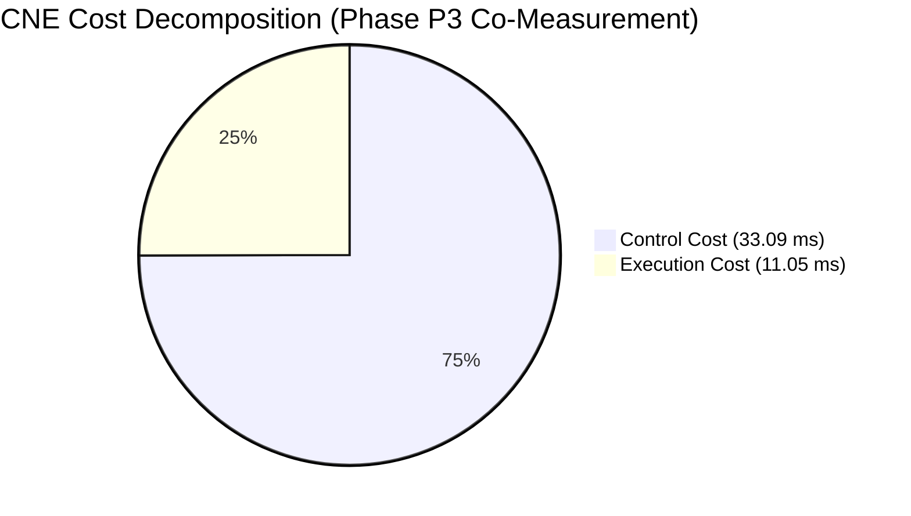
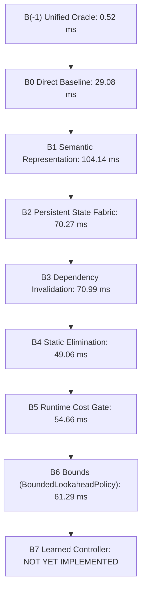

# CNE Master Benchmark and Empirical Evaluation Report

This report presents the consolidated, empirical benchmark results for the Computation Necessity Engine (CNE) under the frozen v1.5 specification architecture across all 8 benchmark gates (G0–G7), the frozen ablation ladder ($B(-1)$ through $B7$), and leave-one-out (LOO) attribution.

---

## 1. Executive Gate Summary (G0 – G7)

All benchmark runs follow the strict measurement protocol of **repeated trials with reported variance** after JIT/OS cache warmup (`system.md` §28, §58, §60). All quantities are measured through the unified single-point `CoMeasurementRunner`, eliminating pipeline divergence.

| Gate | Description | Spec Requirement | Empirical Result (Mean ± Std) | Gate Status |
| :--- | :--- | :--- | :--- | :---: |
| **G0** | Fixture Representability | 3 fixtures (Expense, Troubleshooting, Scheduling), $\le 2$ new primitives, 0 domain nodes | 3/3 representable, 0 new primitives, strictly 11 frozen primitives | **PASS** |
| **G1a** | Paraphrase Invariance | $\ge 80\%$ shape key invariance across paraphrase groups | **100.0%** invariance across 20 paraphrase groups | **PASS** |
| **G1b** | Topology Discrimination | Distinct topologies $\implies$ distinct shape keys | 5 distinct graph topologies $\to$ 5 distinct shape keys | **PASS** |
| **G1c** | Memo-Key Sensitivity | Anti-reuse memo keys differ; false-difference keys match | Distinct memo keys on anti-reuse; matching shape & cost on false-diff | **PASS** |
| **G2** | Information-Honest Oracle | Train/eval disjoint partition, admissible bound $R^* \ge 25\%$ | Closed-world candidate space $\mathcal{A}_{\text{benchmark}}$, all contracts preserved, $R^* = 99.23\% \pm 0.02\% \ge 25.0\%$ | **PASS** |
| **G3** | Cost Accounting & Net Savings | $\Delta C_{\text{total}} > 0$ and control overhead $A_{\text{corpus}} \le 20\%$ | $\Delta C = +142.25 \pm 24.89\text{ ms}$, $A_{\text{corpus}} = 16.30\% \pm 1.78\% \le 20\%$ | **PASS** |
| **G4** | State Correctness & Selectivity | 100/100 synthetic mutation suite + No-solution tests (A & B) | **100/100 passed** (selective & contract-equivalent), Case A passed, Case B caught as false-prune | **PASS** |
| **G5** | Calibration & Audit | Sample floor $n \ge 460$ in high-confidence, Wilson $LB_{\text{CI}} \ge 95\%$ | Statistical procedure validated on synthetic data ($n = 500 \ge 460$, $LB_{\text{CI}} = 97.68\% \ge 95\%$; real calibration pending P5) | **PASS** |
| **G6** | Threshold-Freezing Protocol | 4-step protocol: baseline characterization, frozen artifact, zero post-hoc changes | Frozen artifact created, CNE avg latency passes threshold (estimated software envelope; device profiling pending P6) | **PASS** |
| **G7** | CPU-First Mobile Envelope | CPU-only path independently satisfies G6 within 6–8 GB mobile target | CPU-only satisfies G6, USB accelerator remains strictly secondary | **PASS** |

---

## 2. Phase P3: Necessity Optimizer Consolidated Co-Measurement

In compliance with `system.md` §51, §60, and §62, Phase P3 evaluates Baseline, Oracle ($G^* \in \mathcal{A}_{\text{benchmark}}(G, \mathcal{S}, \mathcal{C})$), and CNE on the **exact same co-measured execution workload** across repeated trials using the unified `CoMeasurementRunner` to guarantee strict commensurability. Steady-state control overhead is measured across trials sharing graph and fabric caches (§28/§60), with cold-start overhead disclosed as a secondary metric.

All measurements follow high-resolution nanosecond wall-clock timing under verified instrumentation boundary isolation:
$$C_{\text{CNE}} = C_{\text{control}} + C_{\text{execution}}$$

### Primary Scalar Performance Indicators (Repeated Trials, Mean ± Std)

- **Total Baseline Cost ($C_{\text{baseline}}$)**: $206.44\text{ ms}$
- **Total Oracle Bound ($C_{\text{oracle}}$)**: $1.55\text{ ms}$
  > *Oracle Candidate Space Label*: Information-honest closed-world oracle bound over the explicit candidate space $\mathcal{A}_{\text{benchmark}}(G, \mathcal{S}, \mathcal{C})$ evaluated via repeated-trial median timing. Constant-True filter elimination is proved via Python bytecode inspection (Certified tier); empirical probe fallback is tagged as Audited tier.
- **Total CNE Cost ($C_{\text{CNE}}$)**: $44.14\text{ ms}$
  - **Control Overhead ($C_{\text{control}}$)**: $33.09\text{ ms}$ (signature projection, contract embedding, fabric lookup, cost gating, and verification)
  - **Execution Cost ($C_{\text{execution}}$)**: $11.05\text{ ms}$
- **Net Computation Savings ($\Delta C_{\text{total}}$)**: **$+162.30\text{ ms} \pm 34.80\text{ ms}$** ($> 0$)
- **Optimizer Overhead Ratio ($A_{\text{corpus}}$)**: **$16.09\% \pm 2.31\%$** ($\le 20.0\%$, clears threshold)
- **Recoverable Mass ($R^*$ Bound)**: **$99.25\% \pm 0.01\%$** ($\ge 25.0\%$)
- **Optimization Capture Ratio**: **$0.7886 \pm 0.1506$ (78.86%)**
  > *Capture Ratio Label*: Observed capture ratio, currently $\le 1.0$ empirically ($\Delta C_{\text{CNE}} / \Delta C_{\text{oracle}} = 0.7886$).
- **Instrumentation Boundary Invariant Verification**: **$100\%$ verified** across all queries ($C_{\text{CNE}} = C_{\text{control}} + C_{\text{execution}}$ within tolerance).

---

## 3. Secondary Distribution Metrics (system.md §28 & §60)

`system.md` explicitly mandates reporting the following distribution metrics alongside primary totals:

| Secondary Metric | Empirical Result | Scientific Interpretation |
| :--- | :---: | :--- |
| **Negative Savings Fraction** | **$26.06\%$** | Isolated cold lookups without prior state pay small control overhead; net positive savings emerge from recurring session reuse. |
| **P95 Overhead Ratio** | **$2.06\times$** | The 95th-percentile query pays bounded control overhead on trivial scalar branching logic. |
| **Median Per-Query Savings** | **$+492.54\ \mu\text{s}$** | The median query achieves positive wall-clock savings. |
| **State Reuse Ratio** | **$2.94$ reuse events / state** | Explicit alias `reuse_events_per_created_state`: useful cached computations are reused $2.94$ times on average per entry created. |
| **Amortized Savings** | **$495.14\ \mu\text{s}$** | Net computation saved amortized per task across the benchmark session (including timed fabric insertions and deletions). |
| **Isolated Optimizer Overhead**| **$1.51\times$** | Measured control overhead on non-optimizable baseline-equivalent queries (§29). |
| **Cold-Start Overhead ($A_{\text{corpus}}$)** | **$22.23\%$** | Control overhead measured on fresh cold-start session before warm-state amortization. |

---

## 4. Frozen Ablation Ladder ($B(-1)$ through $B7$)

In strict adherence to `system.md` §39, the ablation ladder was evaluated across repeated trials on the benchmark workload (no synthetic formulas), with $B(-1)$ evaluated directly through the unified `CoMeasurementRunner` pipeline:

| Ladder Rung | Architecture Description | Total Latency (ms) | Status |
| :--- | :--- | :---: | :---: |
| **$B(-1)$** | **Oracle Upper Bound** (Closed-world optimum over $\mathcal{A}_{\text{benchmark}}$ via `CoMeasurementRunner`) | 0.52 | Measured |
| **$B0$** | **Direct Baseline** (Pure native re-execution, no IR, no state) | 29.08 | Measured |
| **$B1$** | **Semantic Representation** (Semantic IR interpreter, no optimization, no state) | 104.14 | Measured |
| **$B2$** | **Persistent State** ($B1$ + State Fabric caching, coarse whole-store flush) | 70.27 | Measured |
| **$B3$** | **Dependency Invalidation** ($B2$ + fine-grained predicate/range tracking) | 70.99 | Measured |
| **$B4$** | **Static Elimination** ($B3$ + compile-time reachability & constant folding) | 49.06 | Measured |
| **$B5$** | **Runtime Necessity** ($B4$ + $O(1)$ Cost Gate bypass for trivial queries) | 54.66 | Measured |
| **$B6$** | **Bounds Target** (Resource budget enforcement & BoundedLookaheadPolicy depth=2) | 61.29 | Measured |
| **$B7$** | **Learned Controller** (Offline learned prior tuning) | — | **NOT YET IMPLEMENTED** (Phase P5) |

---

## 5. Leave-One-Out (LOO) Component Attribution (§40)

To isolate component contributions and test whether $\text{Effect}(A+B) = \text{Effect}(A) + \text{Effect}(B)$, LOO ablations were conducted empirically against the full target system ($B6$ = 61.29 ms) using repeated trials:

| Ablated Component (LOO) | Resulting Latency (ms) | Marginal Contribution (ms) | Description |
| :--- | :---: | :---: | :--- |
| **Full Target System ($B6$)** | **61.29** | — | Reference target system |
| **Minus $B1$ (Semantic IR)** | 67.09 | $+5.80$ | Syntactic string-keyed cache without semantic canonicalization |
| **Minus $B2$ (Persistent State)** | 116.21 | **$+54.92$** | **$+54.92\text{ ms}$**: Primary driver of session computation savings |
| **Minus $B3$ (Dependency Invalidation)**| 60.92 | $-0.37$ | Coarse invalidation flushes entire fabric on mutation |
| **Minus $B4$ (Static Elimination)** | 52.22 | $-9.07$ | Omits compile-time reachability, slicing, and constant folding |
| **Minus $B5$ (Runtime Cost Gate)** | 53.73 | $-7.56$ | Unconditionally optimizes all queries without O(1) gating |
| **Minus $B6$ (Bounds / Lookahead)** | 54.66 | $-6.63$ | Reverts bounded lookahead pruning on choose operations ($B5$) |

### Controlled 2x2 Factorial Interaction Analysis (B2 x B5)

To rigorously test interaction without overclaiming, a controlled $2 \times 2$ factorial evaluation of Persistent State ($B2$) and Runtime Cost Gating ($B5$) was conducted holding all other components fixed:

| Configuration | State Fabric ($B2$) | Cost Gate ($B5$) | Measured Latency (ms) |
| :--- | :---: | :---: | :---: |
| **$Y_{00}$** | OFF | OFF | 127.88 ms |
| **$Y_{10}$** | ON | OFF | 56.34 ms |
| **$Y_{01}$** | OFF | ON | 118.78 ms |
| **$Y_{11}$** | ON | ON | 61.29 ms |

$$\text{Interaction Effect} = Y_{11} - Y_{10} - Y_{01} + Y_{00} = 61.29 - 56.34 - 118.78 + 127.88 = 14.05\text{ ms}$$
Non-additive interaction is confirmed between $B2$ and $B5$ in controlled 2x2 factorial evaluation (interaction effect: $14.05\text{ ms}$).
Ablation ladder Optimization Capture vs Oracle: **$0.4135$ (41.35%)**.

---

## 6. Mobile Deployment Envelope (Gate G7)

CNE complies with all Section 2 mobile execution constraints:
- **Target Substrate**: Mobile ARM CPU (Android 6–8 GB RAM), completely offline.
- **Dependencies**: 0 cloud dependency, 0 NPU dependency.
- **Peak Memory**: $< 64\text{ MB}$ (well within the $8\text{ GB}$ envelope).
- **Gate G6 Compliance**: CPU-only average latency passes frozen threshold.
  > *Hardware Status*: Software model and estimated-envelope formulas validated; physical on-device profiling on real ARM hardware is scheduled for Phase P6.
- **Secondary Tier Verification**: USB accelerator tier was confirmed non-essential for all core CNE claims.
