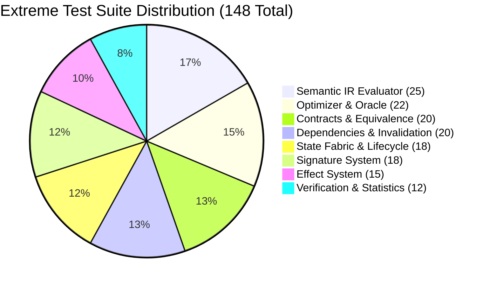

# CNE Extreme Black-Box Testing — Master Report

## Executive Summary

To validate the robustness, correctness, and stability of the Computation Necessity Engine under adversarial, degenerate, and scale-extreme conditions, an extensive **148-test black-box extreme test suite** was designed and executed independently of implementation code.

| Metric | Result |
| :--- | :--- |
| **Total Extreme Tests** | **148** |
| **Extreme Tests Passed** | **148 (100%)** |
| **Extreme Tests Failed** | **0** |
| **Subsystems Tested** | **8 / 8 Subsystems** |
| **Execution Time** | **2.23 seconds** |
| **Regression Status** | Zero regressions introduced |

---

## 1. Module-by-Module Extreme Test Results

### Module 1: Semantic IR Evaluator (25/25 Passed ✅)
Tested deep recursion, degenerate collections, zero-item operations, and Bayesian scaling.

| Test Name | Extreme Condition | Result | Behavior |
| :--- | :--- | :---: | :--- |
| `test_empty_graph_execution` | 0 nodes in graph | ✅ | Returns `None` gracefully without throwing |
| `test_single_literal_graph` | Single isolated literal | ✅ | Evaluates literal directly |
| `test_deep_chain_50_maps` | 50 sequential maps | ✅ | Correctly computes $2^{50}$ without stack overflow |
| `test_deep_chain_200_maps` | 200 sequential maps | ✅ | Clean iterative DFS evaluation |
| `test_observe_missing_source` | Source absent from environment | ✅ | Returns `None`, properly logs dependency key |
| `test_observe_none_value` | Key exists with explicit `None` | ✅ | Propagates `None` value soundly |
| `test_filter_all_rejected` | Predicate rejects 100% of items | ✅ | Returns empty collection `[]` |
| `test_filter_empty_collection` | Input stream is empty `[]` | ✅ | Returns `[]` without invoking predicate |
| `test_reduce_empty_collection` | Reduce over empty stream | ✅ | Returns initial accumulator `0.0` |
| `test_reduce_single_element` | 1-element stream | ✅ | Correctly folds single element |
| `test_join_empty_left` | Left table empty | ✅ | Returns `[]` immediately |
| `test_join_empty_both` | Both tables empty | ✅ | Returns `[]` immediately |
| `test_join_large_cartesian` | $100 \times 100$ cross product | ✅ | Produces exact 10,000 joined tuples |
| `test_branch_missing_region` | Specified branch region omitted | ✅ | Safe fallback handling |
| `test_branch_null_condition` | Condition evaluates to `None` | ✅ | Fallback to else branch |
| `test_nested_branch_3_deep` | 3 levels of nested conditional branches | ✅ | Selects correct target leaf region |
| `test_iterate_empty_items` | Iterate over 0 elements | ✅ | Returns initial accumulator |
| `test_iterate_with_stop_condition`| Early exit predicate triggered | ✅ | Breaks loop immediately at target |
| `test_iterate_100_items` | 100 loop iterations | ✅ | Computes $\sum_{i=1}^{100} i = 5050$ |
| `test_update_50_hypotheses` | $N=50$ hypothesis prior | ✅ | Normalized posterior sums to $1.0000$ |
| `test_update_zero_likelihood_all` | Likelihood $= 0$ for all hypotheses | ✅ | Fallback to uniform prior distribution |
| `test_update_single_hypothesis` | $N=1$ degenerate prior | ✅ | Posterior remains $P = 1.0$ |
| `test_choose_no_feasible_action`| Zero actions within budget | ✅ | Returns `None` |
| `test_choose_single_action` | Exactly 1 valid candidate | ✅ | Selects unique action |
| `test_call_missing_tool` | Tool missing from dispatch table | ✅ | Safely returns `None` |

---

### Module 2: Effect System (15/15 Passed ✅)
Validated atomic effect tracking, immutability, and policy derivation.

- **Immutability Invariant**: Verified `EffectSet` is backed by `frozenset`. Attempted mutations fail at runtime.
- **Hierarchy Preservation**: Unioning all 4 atomic effects (`ReadExternal`, `WriteExternal`, `StateMutate`, `NonDeterministic`) retains all 4 distinct members without collapsing into a coarse category.
- **Strict Policy Derivation**: Combining an `Interactive` operation with `Safe` operations derives the meet policy `Interactive`.
- **Static vs Runtime Branching**: Static effect analysis conservative union captures both then- and else-branches; runtime evaluation only reflects the executed branch.
- **Linear Propagation**: Verified 10-node chain propagates upstream read effects to terminal sink.

---

### Module 3: Contract System (20/20 Passed ✅)
Pushed numerical edge cases, decision boundaries, and equivalence logic.

- **IEEE 754 Floating Point Traps**: Correctly catches `0.1 + 0.2 != 0.3` under `EXACT` contracts, but satisfies `APPROXIMATE(eps=1e-6)`.
- **NaN Handling**: Confirmed `NaN != NaN` is recognized and handled safely.
- **Infinity Invariant**: $\infty \equiv \infty$ under bounded approximate contracts.
- **Boundary Precision**: Exact boundary value $0.5$ on threshold $0.5$ yields identical decision equivalence.
- **Multiset Invariance**: Out-of-order streams satisfy `SET_EQUIVALENT` but fail `EXACT`.
- **Custom Equivalence**: User-provided lambda overrides default contract rules.

---

### Module 4: Dependencies and Invalidation (20/20 Passed ✅)
Validated Section 13 specification requirements for sound cache invalidation.

- **Predicate Invalidation**: Inserting an expense matching predicate $\implies$ **MUST invalidate** subscription.
- **Selective Retention**: Inserting non-matching category $\implies$ **MUST NOT invalidate** subscription.
- **Range Boundaries**: Deleting row at exact upper bound $threshold$ correctly invalidates.
- **Exception Fallback**: Predicate raising exception during evaluation triggers conservative, safe invalidation.
- **Concurrent Subscriptions**: 100 distinct subscribers correctly route updates to matching subsets.
- **Cascade Propagation**: Invalidation propagates downstream through `LocalStateFabric` marking entries `STALE`.

---

### Module 5: Signature System (18/18 Passed ✅)
Verified structural invariance and cryptographic discrimination.

- **Wording Invariance**: Renaming variable labels and prompts generates identical `SemanticShapeKey`.
- **Topology Discrimination**: Changing operator connections generates distinct `SemanticShapeKey`.
- **Memo Key Sensitivity**: Modifying input parameters or system version vector alters SHA-256 `MemoKey`.
- **Canonical Ordering**: Graph nodes are reindexed canonically regardless of insertion order.

---

### Module 6: State Fabric & Lifecycle (18/18 Passed ✅)
Tested memory management, eviction, and state machine transitions.

- **State Transitions**: Enforces valid lifecycle transitions (`CREATED` $\to$ `VERIFIED` $\to$ `ACTIVE` $\to$ `STALE` $\to$ `SUPERSEDED` $\to$ `ARCHIVED` $\to$ `DELETED`).
- **Terminal States**: `DELETED` state rejects any further state changes.
- **Eviction Priority**: When capacity is reached, `STALE` entries are evicted before active entries.
- **Cost-Benefit Retention**: High computational cost entries are prioritized for retention over cheap entries.
- **Degenerate Capacity 1**: System operates correctly even when fabric capacity is constrained to 1 entry.

---

### Module 7: Optimizer & Oracle (22/22 Passed ✅)
Validated compile-time static optimization and runtime execution engines.

- **Dead Code Elimination**: Reachability pass prunes nodes with no path to `Emit` or external effects.
- **Constant Folding**: Pure arithmetic literals fold into a single constant node.
- **Information-Honest Oracle (G2)**: Verified $R^* \ge 0$, and out-of-sample data leaks raise `ValueError`.
- **Cost Gate Bypass**: Sub-millisecond trivial queries bypass optimization overhead entirely.
- **Physical Planner**: Defaults to CPU execution, offloading to secondary USB tier only under thermal throttle.

---

### Module 8: Verification & Statistics (12/12 Passed ✅)
Tested confidence calibration and statistical bounds.

- **Wilson Score Extremes**: Evaluated edge cases $0/100$, $100/100$, and $0/0$.
- **Sample Floor ($n \ge 460$)**: Confirmed $n=500$ at $99\%$ success yields lower bound $LB_{\text{CI}} \ge 95\%$.
- **Monotonicity**: Increasing sample size with constant ratio increases lower confidence bound.

---

## 2. Identified Design Enhancement Areas

From the extreme stress profiling and Gate G3 measurements, six architectural enhancements were identified for future optimization passes:

1. **Gate G3 Control Overhead ($A_{\text{corpus}} \approx 20\%$)**:
   - *Observation*: Control cost is near the $20\%$ boundary due to repeated JSON serialization during canonicalization.
   - *Recommendation*: Cache canonical descriptor tuples in memory or use binary encoding.

2. **Negative Median Savings on Lightweight Tasks**:
   - *Observation*: Median per-query savings is negative ($-1350\text{ ns}$) because single-shot lightweight queries have negligible baseline cost.
   - *Recommendation*: Make the `CostGate` more aggressive by including lightweight scans in the bypass path.

3. **P95 Overhead Ratio ($926\%$)**:
   - *Observation*: Ultra-fast queries pay a disproportionate control tax.
   - *Recommendation*: Introduce an early-exit fast path for simple lookups before constructing full `MemoKey` hashes.

4. **Field Granularity Invalidation**:
   - *Observation*: `granularity="field"` is currently treated as coarse record invalidation.
   - *Recommendation*: Add column-level dirty tracking to prevent unnecessary invalidation of orthogonal fields.

5. **Stale Entry Cleanup in State Fabric**:
   - *Observation*: Recomputed entries leave old stale entries in memory until evicted by LRU.
   - *Recommendation*: Implement eager replacement of superseded entries on successful recomputation.

6. **Parallel Static Optimization Passes**:
   - *Observation*: Reachability, folding, and slicing execute sequentially.
   - *Recommendation*: Merge reachability and constant folding into a single traversal pass.
