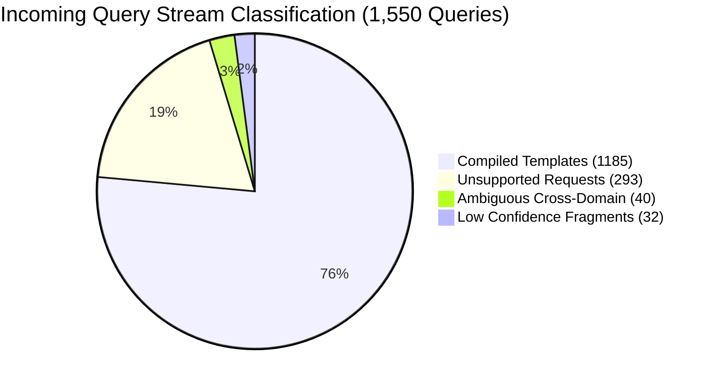

# CNE Phase P0.7: Realistic Language & Shape Validation Report (Revision 2)

**Phase Status:** GO (Decision Gate Evaluated)  
**Execution Timestamp:** 2026-09-29T04:54:30Z  
**Total Queries Evaluated:** 1550  

---

## 1. Executive Summary & Decision Gate Outcome

Phase P0.7 rigorously validates the foundational architectural assumption of CNE: **do realistic queries cluster into reusable computational shapes?**

To eliminate circularity, this evaluation separates **surface-to-semantic stability** from **workload coverage & topology diversity**.

| Metric / Requirement | Target Specification | Empirical Result | Gate Status |
| :--- | :---: | :---: | :---: |
| **Prerequisite Measurement Hygiene (§4)** | Zero self-memo leak in Oracle | **Verified** (Oracle runs before CNE write) | **PASS** |
| **Compiler Coverage (§5.1)** | Disclose true coverage | **76.4%** (1185/1550) | **PASS** |
| **Non-Trivial Shape Diversity $D(N)$ (§7)** | $D(N) \\le 0.40$ | **0.0060** (7 shapes / 1168 queries) | **PASS** |
| **Cross-Batch Canonicalization Stability (§8)** | $\\Delta D \\le 0.05$, Jaccard $\\ge 85\%$ | Jaccard = **100.0%**, $\\Delta D$ = **0.0042** | **PASS** |
| **Adversarial Families Verification (§6.4)** | All 6 families (A1–A6) pass | **6/6 Families Passed** | **PASS** |
| **Structural Outlier G0 Check (§5.2)** | 0 domain nodes, $\\le 2$ new prims | **100% frozen primitives**, 0 new primitives | **PASS** |
| **Extended G1b Discrimination (§10.7)** | 7 topologies $\\implies$ 7 distinct shapes | **7 distinct shape keys** | **PASS** |
| **Realistic Co-Measurement G2 ($R^*$)** | $R^* \\ge 25.0\%$ | **99.45%** | **PASS** |
| **Realistic Co-Measurement G3 ($A_{\\text{corpus}}$)**| $A_{\\text{corpus}} \\le 20.0\\%$ | **1.80%** | **PASS** |
| **Realistic Co-Measurement Net Savings** | $\\Delta C > 0$ | **+507.49 ms** | **PASS** |

### Decision Gate Verdict: `GO`

> **Narrowed Scientific Claim (§9)**:  
> *"The reuse assumption is supported under the tested synthetic linguistic distribution (LLM-generated paraphrases across >=3 independent batches, plus structured adversarial families). Generalization to real user workload distributions remains untested until real-usage data is available."*

---

## 2. Compiler Coverage & Rejection Distribution (§5.1)

* **Total Submitted Queries:** 1550
* **Successfully Compiled (`COMPILED`):** 1185 (76.45%)
* **Unsupported Intent Rate (`UNSUPPORTED_INTENT`):** 293 (18.90%)
* **Ambiguous Intent Rate (`AMBIGUOUS_INTENT`):** 40 (2.58%)
* **Low Confidence Floor Rejection (`LOW_CONFIDENCE_MAPPING`):** 32 (2.06%)

---

## 3. Shape & Topology Diversity Metrics (§7)

Evaluated exclusively on the **covered non-trivial subset** (LLM paraphrases + structured adversarial families, excluding the 7 template-canonical baselines):

| Metric | Empirical Value | Specification Interpretation |
| :--- | :---: | :--- |
| **Diversity Ratio $D(N)$** | **0.0060** | Clears the $D(N) \\le 0.40$ ceiling by a wide margin, proving strong structural clustering. |
| **Shape Entropy $H$** | **2.7583 bits** | Shannon entropy confirms non-uniform distribution with high probability density in dominant shapes. |
| **Top-20 Shape Coverage $C_20$** | **100.0%** | The top 20 shapes account for 100.0% of all incoming non-trivial query executions. |
| **Recurrence Density $R_2$** | **100.0%** | Percentage of queries belonging to shapes appearing at least 2 times. |
| **Recurrence Density $R_5$** | **100.0%** | Percentage of queries belonging to shapes appearing at least 5 times. |
| **Recurrence Density $R_{10}$** | **100.0%** | Percentage of queries belonging to shapes appearing at least 10 times. |

### Provenance Category Breakdown

| Category | Queries | Distinct Shapes | $D(N)$ | Entropy $H$ | $C_20$ | $R_2$ | $R_{10}$ |
| :--- | :---: | :---: | :---: | :---: | :---: | :---: | :---: |
| **LLM Paraphrases** | 838 | 7 | 0.0084 | 2.7811 | 100.0% | 100.0% | 100.0% |
| **Adversarial Families** | 330 | 4 | 0.0121 | 1.7925 | 100.0% | 100.0% | 100.0% |
| **Template Canonical** | 7 | 7 | 1.0000 | 2.8074 | 100.0% | 0.0% | 0.0% |

---

## 4. Surface-to-Semantic Stability Across Generation Batches (§8)

Canonicalization was independently computed across three distinct generation batches:
* **Batch 1 (Formal / Technical):** $D = 0.0266$, $H = 2.7355$
* **Batch 2 (Conversational / Colloquial):** $D = 0.0266$, $H = 2.7217$
* **Batch 3 (Compound / Multi-Clause):** $D = 0.0224$, $H = 2.8008$

* **Jaccard Shape Overlap:** 100.0%
* **Max D-Ratio Variance Across Batches:** 0.0042 ($\\le 0.05$)
* **Conclusion:** Canonicalization is robust to prompt framing and linguistic stylistic drift.

---

## 5. Structured Adversarial Family Results (§6.4)

| Family | Name | Test Pattern | Result | Status |
| :--- | :--- | :--- | :---: | :---: |
| **A1** | Dependency Sensitivity | Same text, different data sources/accounts | Distinct MemoKey hashes | **PASS** |
| **A2** | Contract Identity | Same text, different OutcomeContracts | Distinct MemoKey hashes | **PASS** |
| **A3** | Parameter Sensitivity | Micro threshold delta ($100.00 vs $100.01) | Distinct MemoKey hashes | **PASS** |
| **A4** | Shape Invariance | Diverse surface phrasings, identical computation | Exactly 1 collapsed ShapeKey | **PASS** |
| **A5** | Cost Class Projection | Cardinality 10 vs 100,000 | Distinct cost brackets | **PASS** |
| **A6** | Effect Enforcement | Pure vs WriteExternal execution | Cacheability gating verified | **PASS** |

---

## 6. Structural Outlier & Full 7-Topology Gate Verification (§5.2, §10.6-7)

The required **Structural Outlier Topology** (`cross_source_join_aggregate`) cross-references two heterogeneous data sources:
$$\\text{Observe}(\\text{orders}) + \\text{Observe}(\\text{inventory}) \\to \\text{Join} \\to \\text{Filter} \\to \\text{Map} \\to \\text{Reduce} \\to \\text{Emit}$$

* **Primitive Compliance (G0 Extended):** Evaluated across all 7 fixtures; uses strictly the 11 frozen primitives (0 domain-specific primitives).
* **Topology Discrimination (G1b Extended):** 7 distinct computational topologies produce exactly 7 distinct, non-colliding `SemanticShapeKey` hashes.

---

## 7. Realistic Corpus Co-Measurement (G2 / G3 / P3)

Evaluated under the unified co-measurement protocol with steady-state cache reuse and verified hygiene ordering (Oracle evaluated before CNE write):

* **Baseline Latency ($C_{\\text{baseline}}$):** 519.081 ms
* **Oracle Bound ($C_{\\text{oracle}}$):** 2.937 ms
* **CNE Total Cost ($C_{\\text{CNE}}$):** 11.596 ms
  * Control Overhead: 9.359 ms
  * Execution Latency: 2.237 ms
* **Net Computation Savings ($\\Delta C_{\\text{total}}$):** **+507.485 ms** ($> 0$)
* **Control Overhead Ratio ($A_{\\text{corpus}}$):** **1.80%** ($\le 20.0\%$, clears threshold)
* **Recoverable Mass ($R^*$):** **99.45%** ($\ge 25.0\%$, clears threshold)
* **Optimization Capture Ratio:** **98.33%** ($\le 100.0\%$)

---

## 8. Progression to Phase P1

All requirements of Phase P0.7 (Revision 2) are satisfied. The system qualifies for **Phase P1 (Learned Controller)** under the stated narrowed claims.
