# Phase P1 Controller Architecture Selection & Specification

**Document:** P1 Controller Architecture Selection  
**Phase:** P1 (Learned Controller Setup)  
**Status:** Architecture Selected & Formally Specified  
**Prerequisites:** Phase P0.7 (Decision Gate: GO), Phase P0.8 (Template Expansion & Domain Triage), 11-Topology Empirical Baseline  

---

## 1. Executive Summary & Objective

In Phases P0.7 and P0.8, CNE proved that **downstream execution, computational signatures, necessity analysis, state fabric reuse, and verification tiers are stable and invariant** across diverse queries and topologies:
- Syntactic variations collapse to canonical signatures ($D(N) = 0.0128 \le 0.40$).
- State fabric reuse saves significant latency ($\Delta C = +64.67\,\text{ms}$, $A_{\text{corpus}} \le 20.0\%$, $R^* = 99.39\%$).
- 11 frozen primitives express all verified workload shapes without any new primitive introduction.

However, two rounds of topology-blind evaluation exposed the **fundamental coverage bottleneck of rule-based pattern matching**:
- In P0.7 (7 templates): Rejection was **86.0%** across 12 domains.
- In P0.8 (10 templates): Rejection was **85.8%**, and novel shapes emerged immediately.
- With Math template (11 templates): Rejection improved to **78.0%** (132/600 compiled), but unassisted rule-based systems hit diminishing returns on non-templated phrasing and cross-domain expressions.

**Phase P1 replaces Layer 2 (L2) regex and heuristic keyword matching with a learned neural controller** that maps Natural Language queries into type-safe Semantic IR Directed Acyclic Graphs (DAGs) and typed slots.

This document presents the **Controller Architecture Selection**, evaluating three candidate architectural paradigms against CNE's stringent invariants, specifying the chosen architecture, and defining the formal L2 controller protocol and schema.

---

## 2. Comparative Evaluation of Candidate Architectures

We evaluate three candidate model paradigms against five critical CNE engineering requirements:
1. **Graph Validity & Schema Adherence**: Must guarantee 100% syntactically valid DAGs conforming strictly to the 11 frozen primitives.
2. **Compositional Generalization (Zero-Shot Emergence)**: Ability to compose primitives into novel topological shapes beyond observed training templates.
3. **Inference Latency & Deployment Envelope**: Must respect the CPU/edge deployment envelope (target $\le 50\text{ms}$ on quantized CPU/NPU).
4. **Calibrated Rejection**: High-precision classification of out-of-scope queries as `UNSUPPORTED_INTENT`, ambiguous queries as `AMBIGUOUS_INTENT`, and malformed queries as `LOW_CONFIDENCE_MAPPING`.
5. **Exact Slot Parameter Extraction**: Accurate extraction of typed entity slots (categories, thresholds, metrics, dates).

```mermaid
graph TD
    subgraph CandidateA["Candidate A: Unconstrained Seq2Seq / LLM"]
        A1["Raw Text Prompt"] --> A2["Autoregressive LLM"]
        A2 --> A3["Free-form JSON / Code Output"]
        A3 -.->|"Risk: Syntax / Hallucination"| A4["Schema Failure (3-12%)"]
    end

    subgraph CandidateB["Candidate B: Dual-Head Classifier + Slot Tagger (GNN/BERT)"]
        B1["Raw Text Prompt"] --> B2["Encoder (DeBERTa / RoBERTa)"]
        B2 --> B3["Fixed Template Head (Softmax)"]
        B2 --> B4["Slot BIO Tagger Head"]
        B3 -.->|"Failure: Zero Novel Shapes"| B5["Cannot generalize beyond N fixed templates"]
    end

    subgraph CandidateC["Candidate C (SELECTED): Grammar-Constrained Autoregressive Controller"]
        C1["Raw Text Prompt"] --> C2["Compact Language Model (Encoder-Decoder / Small Decoder)"]
        C2 --> C3["Grammar Mask (CFG / JSON Schema Lexer)"]
        C3 --> C4["Guaranteed Valid Semantic IR DAG + Typed Slots"]
        C4 --> C5["100% Valid CNE AST + Zero Primitive Hallucination"]
    end
```



### Detailed Candidate Matrix

| Evaluation Dimension | Candidate A: Unconstrained Generative LLM | Candidate B: Dual-Head Intent Classifier + Slot Tagger | Candidate C: Grammar-Constrained Autoregressive Controller (SELECTED) |
| :--- | :--- | :--- | :--- |
| **Architectural Representation** | Dense decoder LLM (e.g., Llama-3-8B, Mistral-7B) outputting raw JSON text. | Encoder backbone (DeBERTa-v3) with sequence classification head + token-level BIO slot tagging head. | Compact Seq2Seq / Decoder (e.g. FLAN-T5-Large, Phi-3-Mini 3.8B, or fine-tuned Llama-3-3B) with grammar-constrained decoding mask. |
| **Graph Validity Guarantee** | **Poor (88–95%)**: Stochastic decoding produces malformed JSON, syntax errors, or hallucinated primitive names. | **High (100%) for known templates**: Hardcoded templates instantiated deterministically. | **Perfect (100%)**: Token-level grammar mask enforces valid JSON and Semantic IR node schema at every decoding step. |
| **Compositional Emergence (Novel Shapes)** | **High**: Can generate arbitrary DAG structures, but frequently hallucinates unsupported node types. | **Zero (0.0%)**: Mathematically restricted to selecting one of $K$ pre-baked template IDs; cannot emit novel topologies. | **High & Controlled**: Can generate novel topological DAGs while strictly restricted to the 11 frozen primitives. |
| **Inference Latency (CPU)** | **Unacceptable**: 300–1200ms per query on CPU; violates Gate G7 deployment envelope. | **Excellent**: 15–35ms on CPU with ONNX Runtime. | **Target-Compliant**: 35–65ms with compact quantized model (INT8/INT4) using grammar prefix trie. |
| **Rejection Handling** | **Inconsistent**: Often attempts to answer open questions rather than returning `UNSUPPORTED_INTENT`. | **Moderate**: Requires calibration threshold on softmax logits. | **Strong**: Dedicated special token branch for 4-way classification (`COMPILED`, `UNSUPPORTED`, `AMBIGUOUS`, `LOW_CONFIDENCE`). |
| **Slot Extraction Precision** | **Variable**: Suffers from hallucinated slot values or format shifts. | **High on spans, poor on normalized values**: Cannot normalize "$100/mo" into scalar numeric `100.0`. | **High on spans and normalization**: Jointly predicts normalized slot values conforming to Pydantic/dataclass schema. |

---

## 3. Selected Architecture: Grammar-Constrained Autoregressive Controller

### 3.1 Architectural Justification
Candidate B is immediately eliminated because it fundamentally replicates the template ceiling of the rule-based compiler: **a fixed-template classifier can never achieve compositional emergence on novel topologies discovered in blind evaluation**.

Candidate A is eliminated due to CPU latency overhead and non-zero schema hallucination rates.

**Candidate C (Grammar-Constrained Autoregressive Controller) is selected.**  
It combines the compositional generalization of autoregressive sequence generation with the mathematical guarantee of 100% valid Semantic IR ASTs. By constraining the decoder logits using a pushdown automaton (PDA) or Context-Free Grammar (CFG) derived directly from CNE's Pydantic/dataclass definitions, invalid tokens (such as non-existent primitives or malformed syntax) have their probability masked to $-\infty$ during beam search or greedy decoding.

---

## 4. Formal Controller Interface Specification

The learned controller sits cleanly at Layer 2, adhering to Python's typing protocol and maintaining strict decoupling from downstream layers:

```python
from __future__ import annotations
from dataclasses import dataclass
from enum import Enum
from typing import Any, Dict, List, Optional, Protocol
from cne.contracts.outcome_contract import OutcomeContract
from cne.semantic_ir.nodes import SemanticIRGraph

class ControllerOutcome(Enum):
    COMPILED = "COMPILED"
    UNSUPPORTED_INTENT = "UNSUPPORTED_INTENT"
    AMBIGUOUS_INTENT = "AMBIGUOUS_INTENT"
    LOW_CONFIDENCE_MAPPING = "LOW_CONFIDENCE_MAPPING"

@dataclass(frozen=True)
class ControllerOutput:
    outcome: ControllerOutcome
    graph: Optional[SemanticIRGraph] = None
    contract: Optional[OutcomeContract] = None
    slots: Dict[str, Any] = None
    confidence_score: float = 0.0
    decline_reason: Optional[str] = None
    shape_key: Optional[str] = None
    raw_ast: Optional[Dict[str, Any]] = None

class LearnedSemanticController(Protocol):
    """
    Authoritative Layer 2 Controller Protocol.
    Replaces rule-based nl_compiler matching while preserving downstream contracts.
    """
    def predict(self, query_text: str, context: Optional[Dict[str, Any]] = None) -> ControllerOutput:
        ...
```

---

## 5. Token Grammar & Schema Constraints

The constrained decoder enforces the following EBNF-equivalent grammar during generation:

```ebnf
ControllerResponse ::= CompiledResponse | RejectedResponse

RejectedResponse   ::= '{' '"outcome":' ('"UNSUPPORTED_INTENT"' | '"AMBIGUOUS_INTENT"' | '"LOW_CONFIDENCE_MAPPING"') ',' '"reason":' String '}'

CompiledResponse   ::= '{' 
                         '"outcome": "COMPILED",'
                         '"contract":' OutcomeContractSchema ','
                         '"slots":' SlotDictionarySchema ','
                         '"nodes": [' NodeSchema (',' NodeSchema)* '],'
                         '"edges": [' EdgeSchema (',' EdgeSchema)* ']'
                       '}'

PrimitiveKind      ::= '"Observe"' | '"Map"' | '"Filter"' | '"Reduce"' | 
                       '"Join"' | '"Branch"' | '"Iterate"' | '"Choose"' | 
                       '"Update"' | '"Call"' | '"Emit"'

OutcomeContractSchema ::= '{'
                            '"level":' ('"EXACT"' | '"APPROXIMATE"' | '"ORDERED_TOP_K"' | '"DECISION_INVARIANT"') ','
                            '"precision":' (Float | 'null') ','
                            '"top_k":' (Integer | 'null') ','
                            '"decision_rule":' (String | 'null')
                          '}'
```

### Invariant Enforcement
1. **Primitive Whitelist**: The decoder vocabulary is masked so that under `node.kind`, ONLY the 11 frozen primitive tokens can be emitted.
2. **DAG Acyclicity**: The generated edge list must form a valid DAG with a unique single root/sink (`Emit`). Post-generation topological sort validation immediately flags any cyclic output as `LOW_CONFIDENCE_MAPPING`.
3. **Deterministic Type Validation**: Generated JSON is parsed into CNE's existing `SemanticIRGraph` dataclass before returning to the caller.

---

## 6. Multi-Task Training Formulation

The controller is trained using a multi-task objective over the serialized training corpus:

$$\mathcal{L}_{\text{total}} = \lambda_1 \mathcal{L}_{\text{outcome}} + \lambda_2 \mathcal{L}_{\text{graph\_ast}} + \lambda_3 \mathcal{L}_{\text{slots}}$$

1. **Outcome Classification Loss ($\mathcal{L}_{\text{outcome}}$)**: Cross-entropy over the 4-way decision (`COMPILED` vs `UNSUPPORTED` vs `AMBIGUOUS` vs `LOW_CONFIDENCE`).
2. **Graph Structure Sequence Loss ($\mathcal{L}_{\text{graph\_ast}}$)**: Autoregressive negative log-likelihood of tokenized AST nodes and directed edges.
3. **Slot Prediction Loss ($\mathcal{L}_{\text{slots}}$)**: Exact slot key-value matching loss, penalizing missing or incorrect parameter extractions.

---

## 7. Model Backbone Candidates & Runtime Deployment

For local CPU-only execution meeting Gate G7 ($\le 128\,\text{MB}$ RAM, $\le 50\,\text{ms}$ latency):
1. **Primary Deployment Backbone**: Fine-tuned **Phi-3-Mini-4k-Instruct (INT4/GGUF)** or **FLAN-T5-Large (ONNX INT8)**.
2. **Grammar Masking Engine**: HuggingFace `outlines` or `guidance` finite-state machine (FSM) index over token vocabularies.
3. **Cold vs Steady-State Caching**: The FSM index is compiled once at startup ($\approx 12\,\text{ms}$) and cached permanently across queries, ensuring zero per-query grammar compilation overhead.
