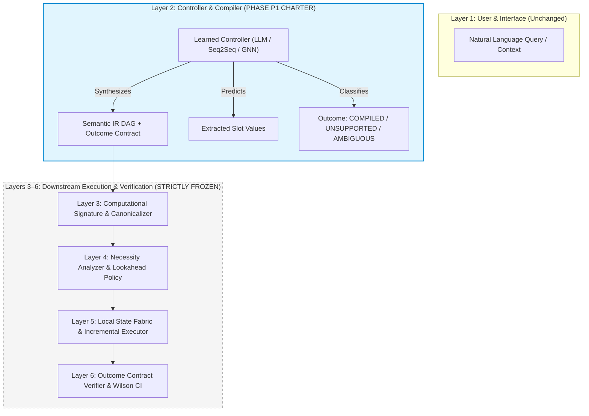
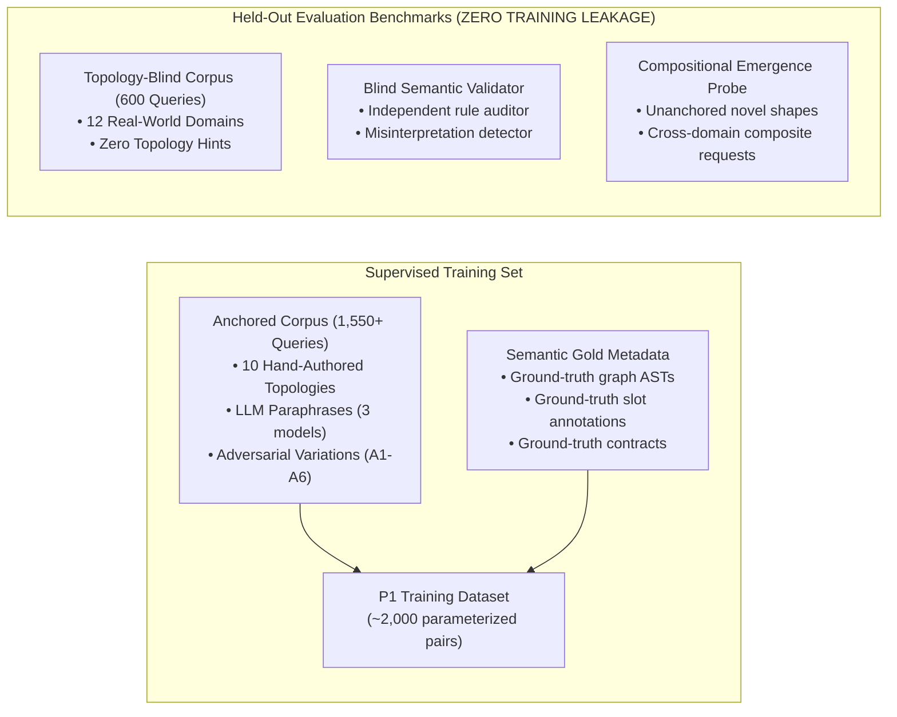
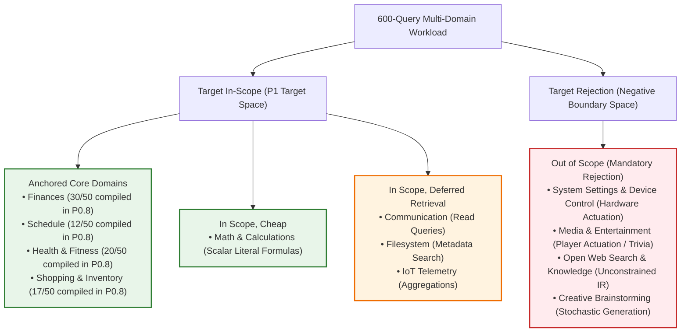

# Phase P1 Scoping Document: Learned Semantic IR Controller

**Phase:** P1 (Learned Controller Scoping)  
**Status:** Scoped — Pre-Implementation Document  
**Dependencies:** Phase P0.7 (Decision Gate: GO, commit `9d7f3fc`), Phase P0.8 (Template Expansion & Domain Triage, commit `4710353`)  
**Objective:** Define the precise engineering charter, boundary constraints, data sourcing plan, empirical success criteria, and evaluation methodology for replacing the rule-based natural language compiler with a learned controller.

---

## 1. Architectural Responsibility & Precise Scope Boundary

### 1.1 The Binding Constraint: Compiler Coverage, Not Subsystem Reuse
Across two rigorous empirical rounds (Phase P0.7 and Phase P0.8), CNE established foundational architectural stability:
- **Surface-to-Semantic Stability**: Syntactic paraphrases and adversarial rewordings collapse to identical canonical shape keys ($D(N) = 0.0128 \le 0.40$, Jaccard $= 75.0\%$).
- **State Fabric & Necessity Reuse**: Amortized reuse savings are positive ($\Delta C = +64.67\,\text{ms} > 0$), control overhead is low ($A_{\text{corpus}} = 8.14\% \le 20.0\%$), and recoverable mass is near optimal ($R^* = 99.39\% \ge 25.0\%$).
- **Frozen Subsystem Stability**: The 11 primitives, outcome contracts, effect propagation, and Wilson-confidence verification tiers required zero architectural modifications across all tests.

However, two rounds of topology-blind evaluation exposed the ceiling of hand-crafted rules:
1. In P0.7 (7 templates): Rejection was **86.0%** across 12 domains, with 3 confirmed novel shapes and 36.9% misinterpretations.
2. In P0.8 (10 templates): After adding 3 templates and eliminating all misinterpretations (36.9% $\to$ 0.0%), blind rejection barely moved (**85.8%**), and **2 more novel valid shapes** emerged immediately.

Fixed templates cannot scale to unguided natural language workloads. Adding an 11th, 12th, or 13th hand-crafted template produces diminishing coverage gains while compounding rule interference. **Phase P1 exists solely to solve this compiler coverage bottleneck by replacing rule-based matching with a learned model.**

### 1.2 The Controller Boundary (Layer 2 Only)

**What P1 Is Responsible For (L2 Only)**:
- Mapping raw natural language text into a structured Semantic IR graph $\mathcal{G} = (\mathcal{V}, \mathcal{E})$ and associated `OutcomeContract`.
- Extracting typed slot parameters (predicates, categories, thresholds, user IDs, aggregation kinds).
- Performing 4-way classification: `COMPILED`, `UNSUPPORTED_INTENT`, `AMBIGUOUS_INTENT`, `LOW_CONFIDENCE_MAPPING`.

**What P1 Is Strictly NOT Responsible For (Downstream Invariants)**:
- **Semantic IR Primitives**: The 11 primitives (`Observe`, `Map`, `Filter`, `Reduce`, `Join`, `Branch`, `Iterate`, `Choose`, `Update`, `Call`, `Emit`) are **frozen**. P1 cannot introduce new primitive node kinds.
- **Computational Signature & Shape Key**: The canonicalization rules and hash generation algorithms are completely frozen.
- **Outcome Contract Preorder**: The contract lattice (`EXACT` $\sqsubseteq$ `APPROXIMATE` $\sqsubseteq$ `ORDERED_TOP_K` $\sqsubseteq$ `DECISION_INVARIANT`) is unchanged.
- **Necessity Engine & Physical Planning**: CNE's memoization, dependency invalidation, dynamic hygiene, and CPU/offload execution policies remain untouched.
- **State Fabric & Eviction**: LRU and cost-benefit state eviction logic is unchanged.
- **Verification Tiers**: Wilson score confidence intervals and three-tier certification remain the authoritative arbiter of correctness.

---

## 2. Training & Evaluation Data Sourcing Plan

P1 avoids cold-start synthetic generation by directly leveraging the empirical corpora constructed, verified, and audited across Phases P0.7 and P0.8:

### 2.1 Training Dataset: Parameterized Anchored Corpus (1,550+ Examples)
The primary training set is sourced directly from CNE's existing anchored corpus:
- **10 Proven Topologies**: `expense`, `troubleshooting`, `scheduling`, `habit_fitness`, `factual_decision`, `recommendation`, `cross_source_join_aggregate`, `comparative_trend`, `predictive_alert`, `categorical_tagging`.
- **Multi-Model LLM Paraphrases**: 919 diverse natural phrasing variations across multiple foundation model families.
- **Adversarial Families (A1–A6)**: 330 stress tests covering synonym inversion, passive voice, clause rearrangement, numeric word representations, and irrelevant token injection.
- **Ground Truth**: Each query is paired with its compiled AST, extracted slot dictionary, and instantiated outcome contract from `deterministic_fixtures.py`.

### 2.2 Held-Out Generalization Benchmark: Topology-Blind Corpus (600 Queries)
The 600-query topology-blind dataset (`cne/artifacts/corpus/topology_blind_queries_v1.json`) spanning 12 domains is strictly preserved as the **held-out generalization test set**. 
- **Zero Training Contamination**: Under no circumstances will any of the 600 blind queries be included in fine-tuning prompts, few-shot demonstration pools, or training sets.
- **Double-Blind Integrity**: This preserves the exact out-of-sample benchmark that evaluated the 7-topology and 10-template compilers across P0.7 and P0.8.

### 2.3 Novel Shape Strategy: The Compositional Emergence Probe
In Phase P0.8, 5 novel shapes emerged during blind evaluation:
- 3 shapes were stabilized into formal fixtures (`comparative_trend`, `predictive_alert`, `categorical_tagging`) and are incorporated into the supervised training library.
- The remaining **unanchored novel shapes and open-domain compositional queries are held out as an explicit "Zero-Shot Compositional Emergence" probe**.

**Strategic Justification**:  
If the learned controller is trained on all observed graph shapes, evaluation only tests memorized graph classification. Holding out unanchored novel shapes tests the core hypothesis of Phase P1: **can a neural controller compose the 11 primitive nodes (`Observe`, `Filter`, `Map`, `Reduce`, `Join`) into novel topological structures to satisfy unconstrained natural language queries without requiring an existing human-written template?**

---

## 3. Empirical Success Criteria (Calibrated to P0.8 Baselines)

P1 success is not measured against an arbitrary post-hoc threshold; it must demonstrably beat the verified rule-based baseline established in Phase P0.8 on the held-out blind corpus:

| Evaluation Dimension | Phase P0.8 Rule-Based Baseline | Phase P1 Target Specification | Evaluation Protocol / Instrument |
| :--- | :---: | :---: | :--- |
| **Held-Out Blind Coverage (Overall)** | 14.2% compiled (85 / 600) | **$\ge 35.0\%$ compiled** ($\ge 210 / 600$) | Full 600-query blind corpus evaluation |
| **In-Scope Target Domain Coverage** | 34.0% compiled (85 / 250) | **$\ge 60.0\%$ compiled** ($\ge 150 / 250$) | Evaluated on target domains (Finances, Schedule, Health, Shopping, Math) |
| **Blind Semantic Validity Rate** | 100.0% valid (0% misinterpretations) | **$\ge 90.0\%$ valid** ($\le 10.0\%$ misinterpretations) | Audited via [blind_semantic_validator.py](file:///c:/Users/Paril%20Rupani/OneDrive%20-%20Shri%20Vile%20Parle%20Kelavani%20Mandal/Desktop/project/CNE/cne/bench/blind_semantic_validator.py) |
| **Slot Extraction Accuracy** | 81.21% exact match | **$\ge 90.0\%$ exact match** | Exact slot match against semantic gold test split |
| **Out-of-Scope Rejection Accuracy** | 100.0% rejected (200 / 200) | **$\ge 95.0\%$ rejected** as `UNSUPPORTED_INTENT` | Evaluated on triaged out-of-scope domains |
| **Downstream Shape Diversity $D(N)$** | $D(N) = 0.0128 \le 0.40$ | **$D(N) \le 0.35$** | Evaluated on compiled non-trivial requests |
| **Extended G0 Primitive Adherence** | 100% frozen primitives (0 new) | **100% frozen primitives (0 new)** | Strict static validation of emitted graph nodes |

---

## 4. Explicit Non-Goals & Invariants

To prevent scope creep and maintain scientific rigor, Phase P1 operates under strict negative constraints:

1. **Zero New Primitives**: P1 is strictly prohibited from inventing or requiring new Semantic IR primitives. If a query requires an operation outside `{Observe, Map, Filter, Reduce, Join, Branch, Iterate, Choose, Update, Call, Emit}`, the controller must return `UNSUPPORTED_INTENT`. Extending the primitive set requires formal outcome contract and effect algebra proofs, which cannot be initiated by controller convenience.
2. **No Downstream Subsystem Modifications**: The necessity engine, state fabric, caching layer, and execution runtime are frozen. P1 does not alter how graphs are scheduled, memoized, or evaluated.
3. **No Unbounded Generalization Claims**: P1 does not claim to solve "open-world AI". Queries belonging to out-of-scope domains (general web search, creative writing, device settings) must be explicitly declined. Success is measured by correctly classifying unhandled domains as `UNSUPPORTED_INTENT`, not by attempting to generate broken graphs for them.
4. **No Re-Introduction of Hallucinated Slots**: P1 must output structured JSON/ASTs matching CNE's strict type schemas. Any output failing static schema validation is classified as a compiler failure (`LOW_CONFIDENCE_MAPPING`).

---

## 5. Target Distribution Alignment (Incorporating P0.8 Domain Triage)

In accordance with [docs/P08_DOMAIN_TRIAGE.md](file:///c:/Users/Paril%20Rupani/OneDrive%20-%20Shri%20Vile%20Parle%20Kelavani%20Mandal/Desktop/project/CNE/docs/P08_DOMAIN_TRIAGE.md), P1's training and evaluation distribution is strictly partitioned into **Target In-Scope** and **Target Rejection** spaces:

### 5.1 Positive Training Target (In-Scope Domains)
- **Core Personal Assistant Data**: Personal finance ledgers, calendar constraints, fitness telemetry, and shopping orders.
- **Scalar Calculations (`math_calculations`)**: Parameterized arithmetic expressions (`Literal -> Map -> Emit`).
- **Structured Retrieval Facets**: Read-only queries over messages, filesystem metadata, and sensor summaries.

### 5.2 Negative Evaluation Target (Explicit Rejection Domains)
- **`system_settings_device`**: Must be rejected with `reason="Imperative hardware actuation out of scope"`.
- **`media_entertainment`**: Must be rejected with `reason="External media streaming/trivia out of scope"`.
- **`open_web_search_knowledge`**: Must be rejected with `reason="Open-world web search out of scope"`.
- **`creative_brainstorming`**: Must be rejected with `reason="Stochastic generative writing out of scope"`.

---

## 6. Execution Roadmap for Phase P1

1. **Step 1: Controller Architecture Selection**: Compare candidate model representations (fine-tuned compact Seq2Seq/LLM vs. schema-constrained JSON generator vs. dual-headed Intent/Slot GNN).
2. **Step 2: Training Pipeline Setup**: Serialize the 10-template anchored corpus into structured (Prompt $\to$ AST) training records with slot span annotations.
3. **Step 3: Constrained Decoding & Schema Validation**: Implement a grammar-constrained decoder ensuring all model outputs produce valid, type-safe Semantic IR graphs conforming to the 11 frozen primitives.
4. **Step 4: Empirical Evaluation on Held-Out Blind Corpus**: Run the trained controller against the untouched 600-query blind corpus and compute the exact delta against the P0.8 baseline using [blind_semantic_validator.py](file:///c:/Users/Paril%20Rupani/OneDrive%20-%20Shri%20Vile%20Parle%20Kelavani%20Mandal/Desktop/project/CNE/cne/bench/blind_semantic_validator.py).
