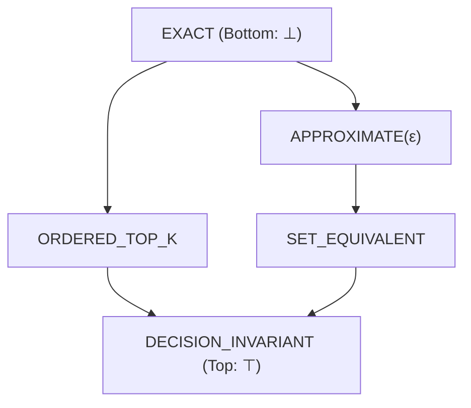

# Theoretical Foundations of Computational Necessity

The Computation Necessity Engine (CNE) provides a formal, mathematically rigorous framework for determining whether a computational step must be executed, whether it can be safely eliminated, or whether a prior intermediate state remains valid.

---

## 1. Formal Problem Statement

Let:
- $\mathcal{G} = (\mathcal{V}, \mathcal{E})$ be a directed acyclic Semantic IR graph of computation, where each node $v \in \mathcal{V}$ corresponds to a primitive operation with inputs $\text{In}(v)$ and output type $\tau(v)$.
- $\mathcal{S} \in \mathfrak{S}$ be the current state of the Local State Fabric, comprising cached intermediate outputs, observations, and system metadata.
- $\mathcal{C}$ be an Outcome Contract specifying acceptable results.
- $\mathcal{B} \in \mathbb{R}^+$ be a finite resource budget (latency in nanoseconds, energy, or memory).
- $C(G, \mathcal{S}): \mathfrak{G} \times \mathfrak{S} \to \mathbb{R}^+$ be the empirical cost function measuring total execution overhead.

### The Central Necessity Optimization Problem

$$\min_{\tilde{G}} C(\tilde{G}, \mathcal{S}) \quad \text{subject to} \quad \tilde{G} \equiv_{\mathcal{C}} G \quad \text{and} \quad C(\tilde{G}, \mathcal{S}) \le \mathcal{B}$$

where $\tilde{G} \equiv_{\mathcal{C}} G$ denotes that the evaluation of $\tilde{G}$ is **contract-equivalent** to the full evaluation of $G$ under all admissible states:

$$\forall \sigma \in \Sigma_{\text{admissible}}, \quad \text{Eval}(\tilde{G}, \sigma) \equiv_{\mathcal{C}} \text{Eval}(G, \sigma)$$

> **Core Axiom**: The engine never declares computation unnecessary merely because it is expensive; an admissible invariant preserving the contract $\mathcal{C}$ must be proven.

---

## 2. Outcome Contract Preorder and Lattice

Let $\mathcal{D}$ be the domain of values produced by a computation. A contract $\mathcal{C}$ defines an equivalence relation $\equiv_{\mathcal{C}} \subseteq \mathcal{D} \times \mathcal{D}$ satisfying reflexivity, symmetry, and transitivity.

We define a preorder $\sqsubseteq$ over contracts where:

$$\mathcal{C}_1 \sqsubseteq \mathcal{C}_2 \iff (\forall x, y \in \mathcal{D}, \; x \equiv_{\mathcal{C}_1} y \implies x \equiv_{\mathcal{C}_2} y)$$

If $\mathcal{C}_1 \sqsubseteq \mathcal{C}_2$, then $\mathcal{C}_2$ is a **relaxation** of $\mathcal{C}_1$.

### Sound Simplification Theorem
Let $T: \mathcal{G} \to \mathcal{G}'$ be a graph transformation. If:
$$\text{Eval}(T(G)) \equiv_{\mathcal{C}_1} \text{Eval}(G) \quad \text{and} \quad \mathcal{C}_1 \sqsubseteq \mathcal{C}_2$$
Then $T(G)$ is also sound under $\mathcal{C}_2$.

---

## 3. Atomic Effect Algebra

Operations interact with the outside world through side effects. CNE categorizes effects into 4 orthogonal atomic dimensions:

$$\mathcal{E} \subseteq \{\text{ReadExternal}, \text{WriteExternal}, \text{StateMutate}, \text{NonDeterministic}\}$$

Effect sets form a boolean algebra under set union ($\cup$) and intersection ($\cap$):

$$\text{Eff}(G) = \bigcup_{v \in \mathcal{V}} \text{Eff}(v)$$

### Policy Derivation
Execution policies dictate when an operation is permissible:
- **`Never`**: Operation strictly prohibited in non-interactive sessions.
- **`Safe`**: Read-only or idempotent operations permitted without restriction.
- **`Ask`**: Modifying or non-deterministic operations requiring user confirmation.
- **`Interactive`**: Operations requiring synchronous user interaction.

When combining policies across a task graph, the engine applies the **meet operation** in the safety lattice:

$$\text{Policy}(G) = \bigwedge_{v \in \mathcal{V}} \text{Policy}(v)$$

where $\text{Never} \prec \text{Interactive} \prec \text{Ask} \prec \text{Safe}$.

---

## 4. Recoverable Mass and Information-Honest Oracle ($R^*$)

To measure how close CNE comes to the theoretical limit of computation reduction, we define the **Admissible Intervention Upper Bound** ($R^*$):

$$R^* = \frac{\sum_{q \in Q_{\text{eval}}} \max(0, C_{\text{baseline}}(q) - C_{\text{oracle}}(q))}{\sum_{q \in Q_{\text{eval}}} C_{\text{baseline}}(q)}$$

where:
- $C_{\text{baseline}}(q)$ is the baseline execution cost without optimization.
- $C_{\text{oracle}}(q)$ is the cost under an optimal oracle that has zero search overhead but obeys strict information honesty.

### Information Honesty Principle
The oracle may explore candidate execution plans but **must never access out-of-sample ground truth** or future states $\mathcal{S}_{t+k}$ ($k > 0$). Violating information honesty collapses the validity of the benchmark.

---

## 5. Sound Invalidation under State Deltas

Let an observation node have dependency key $K = (\text{source}, \text{granularity}, \text{predicate})$.
When an external mutation occurs:

$$\Delta = (\text{op}, \text{target}, \text{row\_data})$$

The dependency manager computes the invalidation predicate:

$$\text{Invalidates}(\Delta, K) = \begin{cases} 
\text{True} & \text{if } K.\text{granularity} = \text{SOURCE} \land \Delta.\text{target} = K.\text{source} \\
P(\Delta.\text{row\_data}) & \text{if } K.\text{granularity} = \text{PREDICATE} \land \Delta.\text{op} \in \{\text{INSERT}, \text{UPDATE}\} \\
\text{True} & \text{if } P \text{ raises an exception (conservative fallback)} \\
\text{False} & \text{otherwise}
\end{cases}$$

### Cascade Soundness Invariant
If node $u$ is invalidated, then all downstream topological descendants $\text{Desc}(u)$ in the state fabric transition to `STALE` before any subsequent read operation executes.

---

## 6. Wilson Score Confidence Interval for Calibration

When auditing verification accuracy across $n$ samples with $k$ observed successes ($\hat{p} = \frac{k}{n}$), the normal approximation fails near $\hat{p} \approx 1$. CNE strictly uses the **Wilson Score Interval** at $\alpha = 0.05$ ($z = 1.95996$):

$$LB_{\text{CI}} = \frac{\hat{p} + \frac{z^2}{2n} - z \sqrt{\frac{\hat{p}(1 - \hat{p})}{n} + \frac{z^2}{4n^2}}}{1 + \frac{z^2}{n}}$$

### Gate G5 Sample Floor
To guarantee that a 99% observed pass rate yields $LB_{\text{CI}} \ge 0.95$, the sample floor $n$ must satisfy:

$$n \ge 460$$
